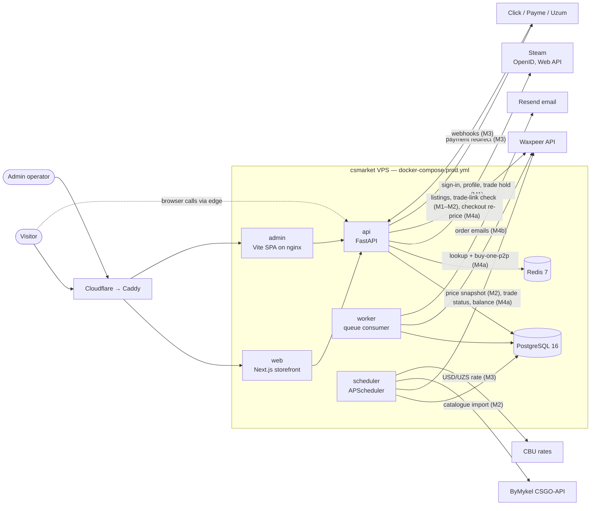

# Architecture overview

csmarket is a modular monolith: one FastAPI app (`apps/api`) owns every table, and two
companion processes run beside it from the same Python package — `apps/worker` drains the
Postgres queue, `apps/scheduler` runs periodic jobs. The storefront (`apps/web`, Next.js) and
the admin SPA (`apps/admin`) talk to the API only. Everything runs as one Docker Compose stack
on one VPS behind its own Caddy, with Cloudflare in front (ADR-0003).

## System context (C4 level 1)

Arrows that arrive after M0 are labelled with their milestone.

## Runtime pieces

| Process     | Image                                                        | What it does                                                                 |
| ----------- | ------------------------------------------------------------ | ---------------------------------------------------------------------------- |
| `api`       | `csmarket-api`                                               | HTTP API under `/api/v1`, probes `/healthz` `/readyz`, `/metrics` (internal) |
| `worker`    | `csmarket-worker`                                            | Drains claimable rows (`FOR UPDATE SKIP LOCKED`), woken by `LISTEN/NOTIFY`   |
| `scheduler` | `csmarket-scheduler`                                         | Times periodic jobs; the work itself is a module's service function          |
| `web`       | `csmarket-web`                                               | Storefront, ru / uz / en; server components call the API over the network    |
| `admin`     | `csmarket-admin`                                             | Static SPA served by nginx                                                   |
| `caddy`     | `caddy:2-alpine`                                             | TLS, routing by host, client-IP normalisation                                |
| monitoring  | Prometheus, Alertmanager, Grafana, Loki, Promtail, exporters | Metrics, alerts to the ops Telegram chat, logs                               |
| `backup`    | `alpine` + pg_dump, age, rclone                              | Nightly encrypted dump to Cloudflare R2                                      |

The queue is the database: the transaction that writes a claimable row also sends `NOTIFY`,
the worker claims with `FOR UPDATE SKIP LOCKED`, and a poll tick catches lost notifications.
Handlers are idempotent. M0 registers no queues and no jobs; both processes start, idle and
stop cleanly. M4a adds the `orders` queue (a paid order → one Waxpeer buy) and the trade
sweeps; the worker and the scheduler expose `/metrics` on internal ports 9101 / 9102.

## Modules by milestone

- **M0** — `core` (config, logging, clock, ids, observability, errors, cache headers, client
  IP, metrics, money, db, redis, idempotency, events, crypto, health); probes; empty
  `/api/v1`; worker and scheduler shells; hello storefront; admin shell.
- **M1** — `auth` (Steam OpenID, EdDSA JWT, rotating refresh, `ip_guard`), `users` (trade link
  and its advisory check), `admin` role gate.
- **M2** — `skins` (catalogue, pricing, Waxpeer client, listings, price sync), storefront
  catalogue and SEO, admin catalogue page.
- **M3** — `fx`, `wallet`, `payments` + `click` / `payme` / `uzum`, balance top-ups.
- **M4a** — `orders` (checkout, pay from the balance or a kassa, worker buy at Waxpeer, trade
  reconcile / protection / audit, refunds to the balance), the buy panel and order page
  (polling), admin orders and trades, order alerts. ADR-0007.
- **M4b** — `realtime` (WebSocket order pushes), `notifications` (email), admin pricing
  editor and dashboard.
- **M5** — launch: VPS, secrets, backups, alerts, runbooks, test buys.

The module list, tables and sources are in [`module-map.md`](./module-map.md).
