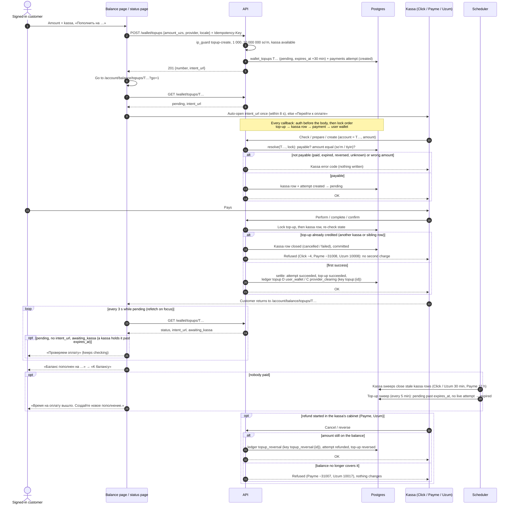

# Flow — Top up the balance

A signed-in customer adds soʻm to their balance through Click, Payme or Uzum. In M3 the
balance only grows and shrinks by top-ups, kassa refunds and admin adjustments; paying from
it arrives with orders (M4). Design: ADR-0006; operations: `docs/runbooks/kassa-setup.md`.

## What the customer sees

1. `/account/balance` («Баланс») shows «На балансе», the top-up form and «История». Signed
   out, it asks to sign in with Steam.
2. They enter an amount (from 1 000 to 10 000 000 soʻm, whole soʻm; quick chips help), choose
   a kassa tile and press «Пополнить на 50 000 сум». A wrong amount is refused in the form with
   «Сумма от 1 000 сум до 10 000 000 сум, без тийинов.». No kassa available: «Пополнение сейчас
   недоступно.».
3. The browser moves to the top-up's own page, `/account/balance/topups/T…`, which opens the
   kassa once (only if the answer came within 8 s; otherwise the «Перейти к оплате» button
   stays). Coming back to this tab later never re-opens the kassa.
4. They pay in the kassa and are returned to the same page. It says «Ждём оплату» and checks
   every 3 seconds (and at once when the tab is focused again), then «Баланс пополнен на 50 000
   сум» with «К балансу».
5. The balance page shows the new balance and a history line «Пополнение» with the amount and
   the top-up's number.

Other endings on the top-up page:

- **Not paid in 30 minutes:** «Время на оплату вышло. Создайте новое пополнение.»
- **Past 30 minutes, but the kassa is still processing it** (`awaiting_kassa`): «Проверяем
  оплату» with «Если вы оплатили, баланс пополнится сам. Новое пополнение не нужно.»; the page
  keeps checking and turns into «Баланс пополнен на …» when the kassa confirms.
- **Refunded by the kassa:** «Пополнение отменено.», and the history shows «Пополнение
  отменено» with a minus.
- **Someone else's or unknown number:** «Пополнение не найдено.» (the API answers 404, never
  403, so a number reveals nothing).
- **Checks ran out** (about 2 minutes): an «Обновить» button restarts them.

Rules the customer never has to know: one top-up is credited once, whatever the kassa repeats;
a second charge on a paid top-up is refused at the kassa, so the card is not charged twice;
a refund the balance no longer covers is refused (the money was spent).

## Sequence

Source: `docs/architecture/sequence-diagrams/topup.mmd`.

- Account field on the wire (R9): Click `merchant_trans_id`, Payme `account.order`, Uzum
  `params.order` (also `orderId`, `order_id`). Amount units: Click soʻm, Payme and Uzum tiyin
  (Uzum's `/check` answers soʻm).
- Locally and in e2e the `mock` kassa (never in prod) stands in: the top-up page shows
  «Оплатить (тест)», which calls the dev-only `POST /api/v1/dev/topups/{number}/pay` and runs
  the same `settle`.
- Rules: spec §5, §7.9, §13; module READMEs `payments`, `wallet`, `click`, `payme`, `uzum`.
