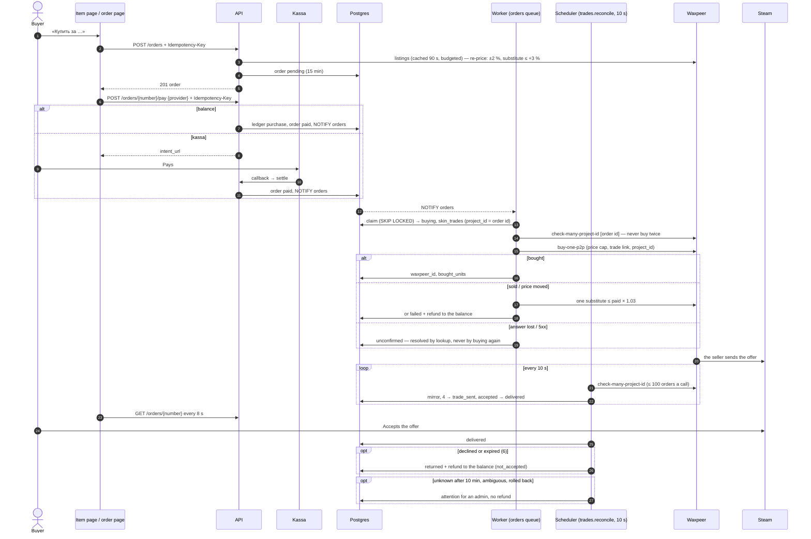

# Flow — Buy a skin

A signed-in buyer picks an offer on an item page, pays from the balance or through a kassa,
and receives the skin as a Steam trade offer from the seller. One skin per order. Design:
ADR-0007; operations: [`orders.md`](../../runbooks/orders.md),
[`waxpeer.md`](../../runbooks/waxpeer.md). Diagrams:
[`checkout.mmd`](../../architecture/sequence-diagrams/checkout.mmd),
[`buy.mmd`](../../architecture/sequence-diagrams/buy.mmd),
[`trade-reconcile.mmd`](../../architecture/sequence-diagrams/trade-reconcile.mmd).

## What the buyer sees

1. **Item page** (`/item/{slug}`), when buying is on: offers have «Выбрать» / «Выбран» (the
   cheapest is pre-selected), and the «Купить» panel shows the method picker («Баланс» —
   pre-selected when it covers the price, else «Не хватает …» with «Пополнить» — then Click,
   Payme, Uzum) and «Купить за 381 000 сум».
   - Signed out: «Войдите через Steam, чтобы купить».
   - No trade link: «Добавьте трейд-ссылку, чтобы купить» + «Добавить ссылку». A link never
     checked is checked once («Проверяем трейд-ссылку…»); a bad one (including a Steam trade
     hold) shows the account page's verdict and the button stays off.
2. **Press «Купить за …».** If the price moved more than 2 %: «Цена изменилась: теперь …»
   (press again to buy at the new price). If the offer was just sold: «Этот лот уже купили.
   Следующий — …» (the next offer is selected), or «Предложения закончились».
   A sold offer is replaced silently by another offer of the same item that costs at most
   3 % more than shown; the buyer is never billed more than they saw.
3. **Paying.**
   - **Balance:** the order is paid at once; the browser goes to `/orders/{number}`.
   - **Kassa:** the browser goes to `/orders/{number}`, which opens the kassa once (within
     8 s; else «Оплатить …» stays). The buyer pays and comes back to the same page. An
     unpaid order expires after 15 minutes: «Время на оплату вышло.»
4. **Order page** («Заказ #N», checked every 8 s, «Обмен в Steam» card):
   - «Покупаем скин — обмен придёт в Steam через минуту.»
   - «Обмен отправлен — примите его в Steam.» with the seller (name, avatar, level),
     «Открыть обмен в Steam» and «Примите до HH:MM» (Steam's offer lives about 30 minutes).
   - «Получено» (+ «Steam защищает обмен до …» while Steam's trade protection runs).
5. **Not accepted in time, or declined:** «Обмен не состоялся — деньги вернулись на баланс.»
   - «Открыть баланс». The balance history shows «Возврат на баланс» beside «Покупка».
6. **Could not buy** (sold at the last moment): the money is back on the balance at once; a
   shortfall on our side reads «Не получилось купить скин — деньги на балансе. Попробуйте
   через несколько минут.»
7. **Unknown outcome** (an answer lost, an ambiguous trade, a rollback): «Мы проверяем
   покупку. Статус обновится на этой странице.» — never a refund promise until an operator
   decides. An open offer stays visible with its link.

«Мои заказы» (`/account/orders`, a tile on the account page) lists the orders, newest
first; unpaid expired ones are left out.

Rules the buyer never has to know: an order is bought at most once; refunds go to the
balance only (a kassa cannot reverse an order payment); nothing is refunded while the skin
may still reach the buyer.

## Status

| Order status | Buyer reads              | Means                                                    |
| ------------ | ------------------------ | -------------------------------------------------------- |
| `pending`    | «Ждёт оплаты»            | Created, payable for 15 min                              |
| `cancelled`  | «Время на оплату вышло.» | Not paid in time (the only way an order is cancelled)    |
| `paid`       | «Оплачен»                | Paid; the worker picks it up within seconds              |
| `buying`     | «Покупаем»               | Being bought at Waxpeer, or bought and the offer not out |
| `trade_sent` | «Обмен отправлен»        | The seller's offer is in Steam                           |
| `delivered`  | «Получен»                | Accepted                                                 |
| `returned`   | «Обмен не состоялся»     | Declined or expired in Steam; refunded to the balance    |
| `failed`     | «Не получилось»          | Not bought (sold, our shortfall, bad link); refunded     |

## Sequence

Full detail: `docs/architecture/sequence-diagrams/{checkout,buy,trade-reconcile}.mmd`.

- Locally and in e2e the dev Waxpeer fake stands in (`CSMARKET_WAXPEER_FAKE`): it "sends" the
  offer 6 s after the buy, and `POST /api/v1/dev/orders/{number}/trade` accepts, declines or
  rolls it back (`docs/onboarding/local-setup.md`). The test kassa reads «Тестовая оплата» /
  «Оплатить (тест)».
- Rules: spec §5, §7.4–§7.8, §10; module READMEs `orders`, `payments`, `wallet`, `skins`.
