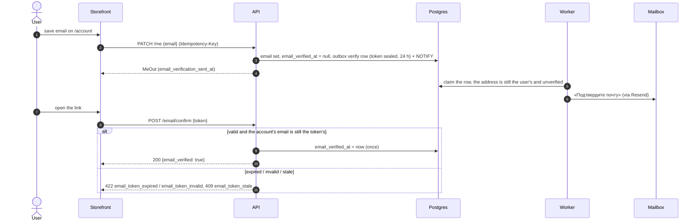

# Flow — Confirm the email

Order letters (paid, trade sent, money back on the balance) go only to a confirmed address
(owner decision D1, ADR-0008).

## What the user sees

1. On `/account`, «Email — Для писем о заказах.» They enter an address and save: «Мы
   отправили письмо со ссылкой — откройте его.»
   A second address saved within a minute of the last letter is kept, but the page says
   «Отправить ещё раз можно через минуту.» — the letter goes out when they press the button.
2. Until it is confirmed: «Почта не подтверждена. Мы отправили письмо на {email}.» and
   «Отправить ещё раз» (once a minute; sooner → «Отправить ещё раз можно через минуту.»).
3. The letter «Подтвердите почту» has one button. It opens
   `/account/email/confirm?token=…` — on any device, signed in or not — which says «Почта
   подтверждена. Теперь письма о заказах будут приходить на неё.» and «В профиль». The
   token leaves the address bar at once.
4. A link older than 24 h: «Ссылка устарела. Отправьте письмо ещё раз в профиле.» A link for
   an address since changed, or a broken one: «Ссылка не подходит. Отправьте письмо ещё раз в
   профиле.»
5. Confirmed: the badge «Подтверждена». A new address starts over.

## Sequence

