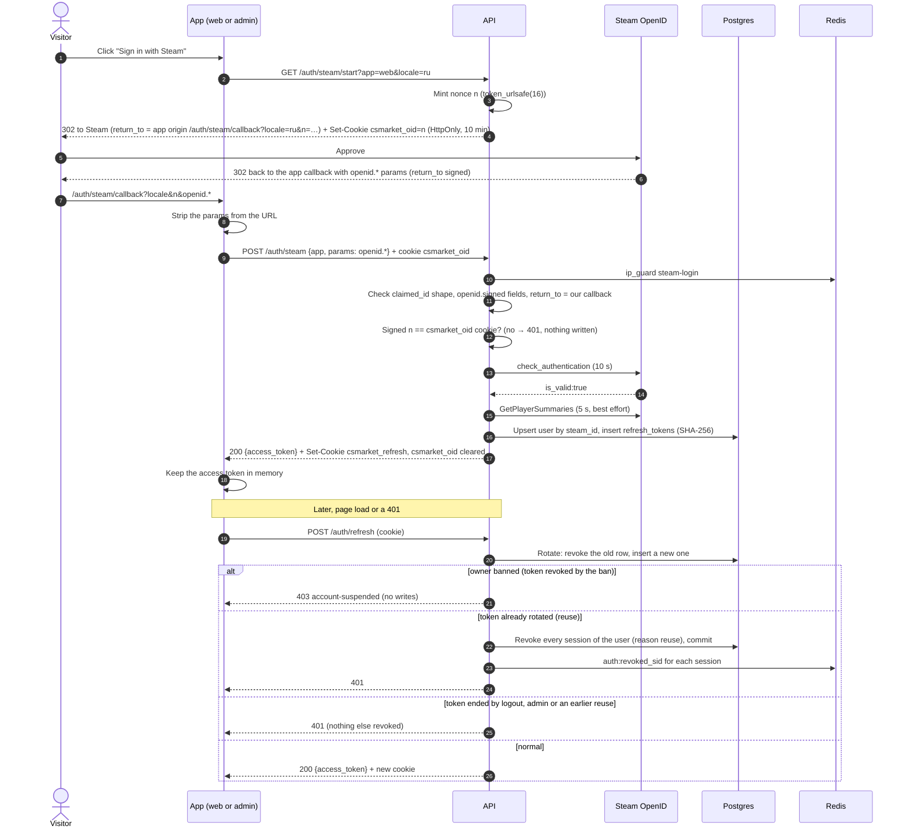

# Flow — Sign in with Steam

Steam is the only sign-in. There is no registration form and no password.

## What the user sees

1. They click «Войти через Steam» in the header (ru / uz / en).
2. Steam's own page asks them to confirm. csmarket.uz is shown as the site.
3. They land on `/account` already signed in, with their Steam name and avatar. A brief
   «Входим через Steam…» screen shows while the callback is processed.
4. Next visits: still signed in for 30 days. Closing the tab does not sign them out.
5. If Steam says no or the link is stale, they see a short error and a button to try again
   (in the language they started in). A Steam return that was not started in this browser
   — for example a link someone else sent — never signs anyone in.
6. A suspended account sees a suspension notice instead of the account page. A ban ends every
   session, and each later visit asks again and is told the account is suspended, so the notice
   stays after a reload. Nothing about the ban is stored in the browser.

The admin (`admin.csmarket.uz`) uses the same sign-in. A signed-in person without the
`admin` role sees «Нет доступа».

## Sequence

Source: `docs/architecture/sequence-diagrams/steam-sign-in.mmd`. Decision: ADR-0004.
