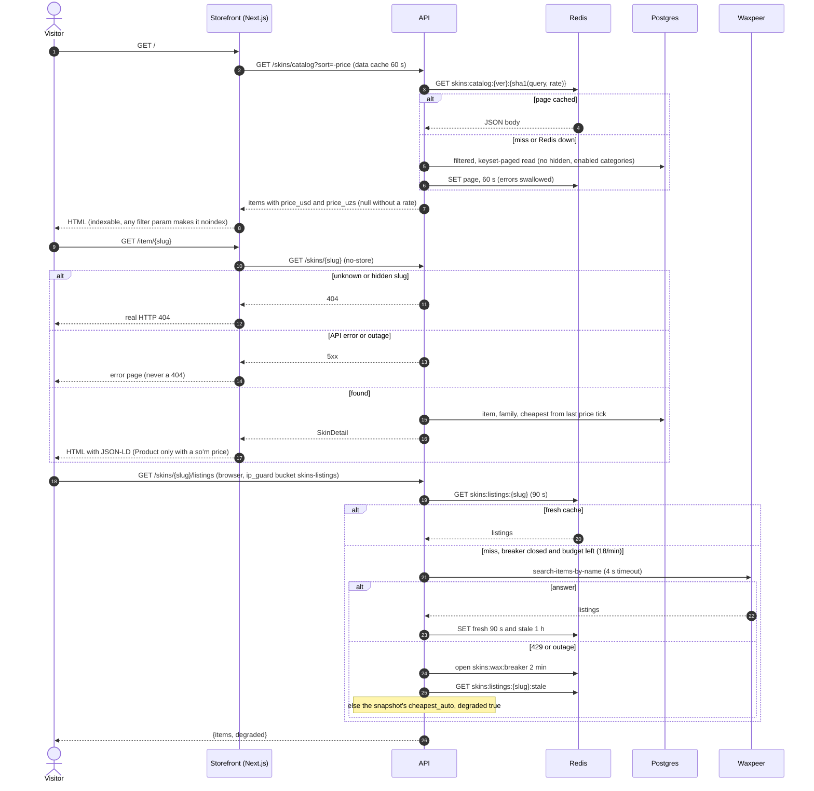

# Flow — Browse the catalogue and open an item

A visitor needs no account to browse (M2). There is no buy button yet: the item page shows
the price and the live offers (owner decision D3). The catalogue is open to search engines
(D2).

## What the visitor sees

1. `/` is the catalogue: categories, filters, search, a grid sorted by price (highest first
   by default). Prices are in soʻm. If no rate is available the prices show in dollars.
2. Typing in the search box suggests items; an admin-defined alias («ак») finds «AK-47».
3. A card opens the item page: the image, the price from, the wears and StatTrak / Souvenir
   variants, the live offers (seller, float, stickers, inspect link) and a short FAQ.
4. Category and weapon landing pages (`/category/knives`, `/weapon/ak-47`) list the same items
   with their own title and text.
5. An unknown or hidden item, category or weapon is a real 404 page.
6. If the live offers cannot be fetched right now, the page shows the last known cheapest
   offers; it never shows an error for that.

## Sequence

## Rules behind it

- The catalogue is ours; nothing Waxpeer-branded reaches the browser. Only `auto` listings
  count.
- A hidden item disappears from every public read. The item page 404s at once; the grid can
  show it up to 60 s and the sitemap up to 1 h (`docs/runbooks/skins-catalogue.md`).
- An outage is never a 404: an API failure renders the error page.
- Redis is never required for a page to render.
